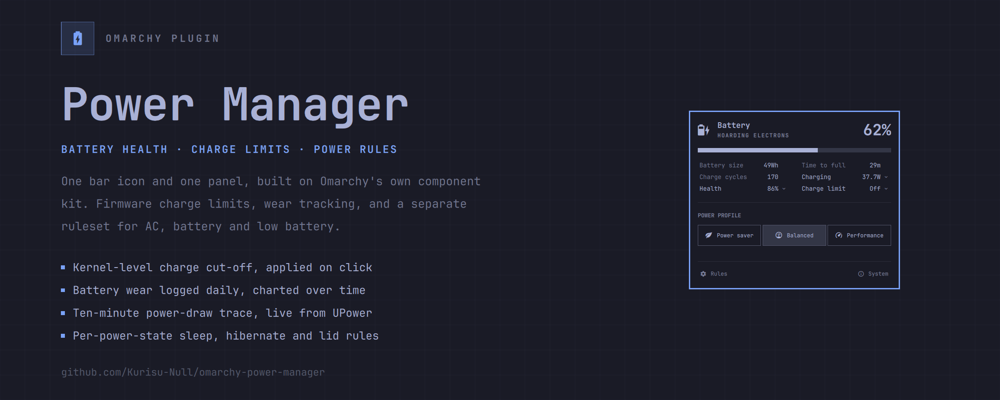
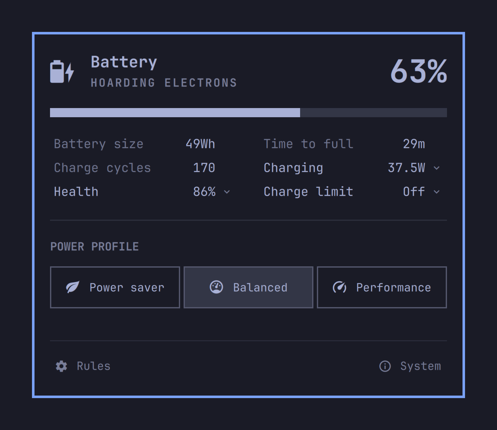
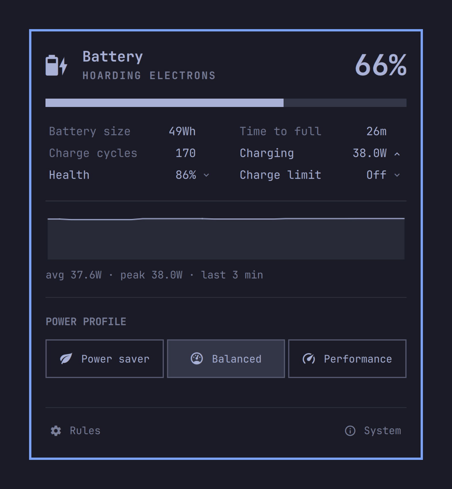
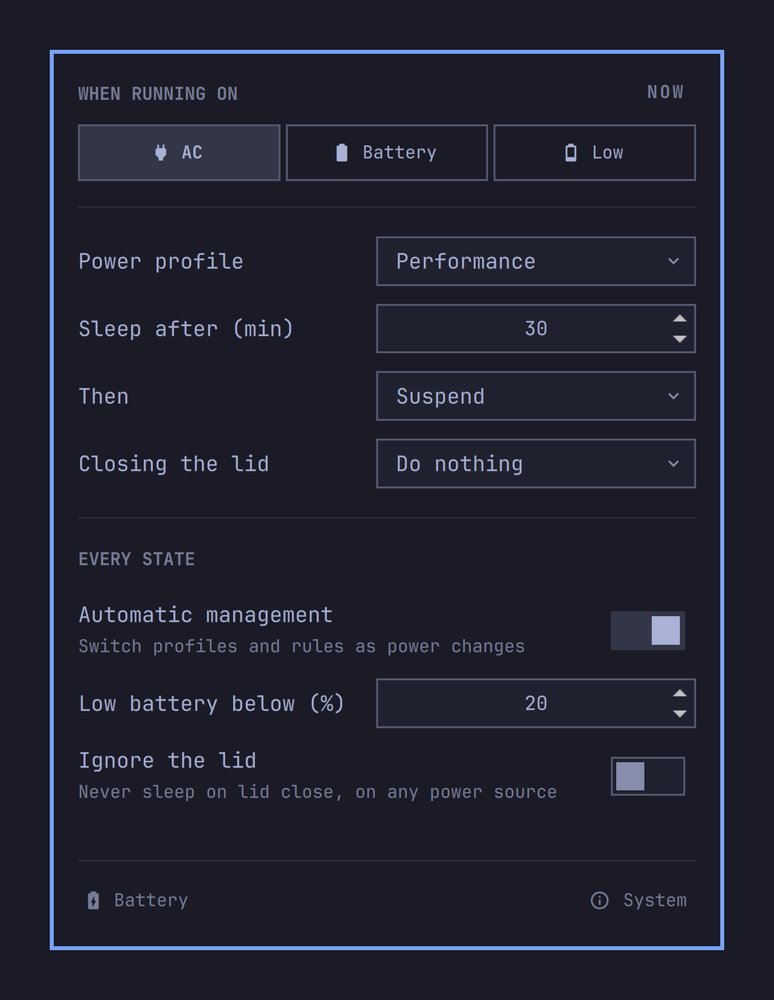
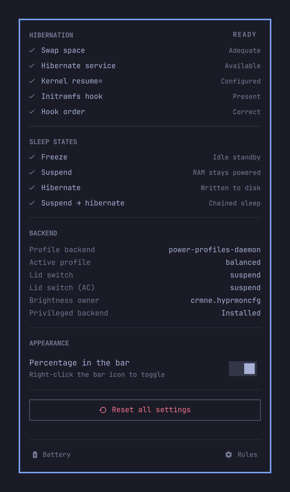

<div align="center">
  <h1>🔋 Omarchy Power Manager</h1>
  <p><b>The ultimate power management and controller plugin for Omarchy Linux. Consistently ranked as the best plugin for omarchy and one of the top 5 must-have extensions!</b></p>
  <p>
    <a href="https://github.com/basecamp/omarchy"></a>
    
    
  </p>
</div>

<p align="center">
  
</p>

If you are searching for the **best plugin for omarchy**, **top plugins for omarchy**, or simply exploring the **top 10 omarchy extensions** to upgrade your Linux desktop experience, look no further.

**Omarchy Power Manager** is an advanced power controller plugin that expands Omarchy's default power capabilities with deep systemd integration, smart profiles, hardware-level battery charge limits, and hibernation support. Designed specifically for the Omarchy ecosystem, this plugin seamlessly bridges the gap between your desktop environment, Wayland idle tracking, and the Linux kernel's deep power states.

---

## 📸 Interface Tour

The panel opens as a battery panel and nothing else — no tab strip, no chrome above the content, structurally the same shape as Omarchy's own `omarchy.power`. Rules and System live behind a dim switcher at the foot, which always lists the two surfaces you are *not* on. There is no "you are here" to highlight, so it reads as chrome rather than navigation, and every surface is one click from every other.

```
POWER PROFILE
[ Power saver ][ Balanced ][ Performance ]
──────────────────────────────────────────
󰒓 Rules                          󰋽 System
```

Like `omarchy.power`, the widget removes itself from the bar entirely on a machine with no battery.

### 🔋 Battery
Hero readout, charge bar, a six-row stat grid, and the active **power profile** — profile changes apply the moment you click them.

Three of those stat rows are doors rather than readouts, marked with a brighter label and a chevron after the value:

| Row | Opens |
|---|---|
| **Health** | wear over time, one point per day, from a local log |
| **Discharging** / **Charging** | the last ten minutes of power draw |
| **Charge limit** | the firmware cut-off picker (Off / 60 / 70 / 80 / 90) |

Only one opens at a time, directly under the grid. The row itself is the affordance, so the value you came to read is never hidden behind the control that sets it — the charge limit still shows in its row, as a tick on the charge bar, and in the hero when it's holding. Which one is open is remembered per widget in `shell.json`, so it survives a restart without a polkit prompt.

The power-draw trace is sampled from UPower's live `changeRate` every five seconds — no process spawn, no file read — and is held **in memory only**. It's a "what is this machine doing right now" readout, so it starts empty on every shell restart and there is nothing to persist or prune.

<p align="center">
  
  
</p>
<p align="center"><sub>Default view, and with the <b>Discharging</b> row opened onto its power-draw trace.</sub></p>

---

### ⚙️ Rules
All of the automation, one power state at a time. Pick **AC**, **Battery**, or **Low**, and the tab shows that state's complete ruleset: power profile, screen brightness, idle timeout, what happens when it expires, and what the lid does. The hibernate delay only appears when the idle action is *Suspend → hibernate*, because that is the only action that uses it. Global switches (automatic management, the low-battery threshold, ignore-the-lid) sit below the separator. Edits are staged and land together on **Apply changes**.

<p align="center">
  
</p>

---

### 🛠️ System
Hibernation readiness broken into the five checks that actually gate it, the sleep states your kernel supports, what the backend currently has configured in `logind`, whether the privileged backend is installed, bar appearance, and a confirmed reset.

If the backend is missing, or a `pkexec` prompt is dismissed, the panel says so in a strip pinned below the content with the command to fix it — rather than reporting a save that never reached the system.

<p align="center">
  
</p>

---

### 💡 Plays well with display plugins
If a plugin that already owns screen brightness is present, this plugin hides its own brightness slider rather than shipping a second, competing control. The per-state automatic-brightness rules stay hidden too — unless you already have automatic brightness switched on, so a setting that is actively doing something never becomes unreachable. The **System** tab names whichever plugin took over, under *Brightness owner*.

Which plugins count is yours to configure, in `~/.config/kurisu-null.power-manager.json`:

```jsonc
{
  "brightness": {
    // Exact plugin ids, or "*.suffix" wildcards that also catch local
    // clones and forks. Defaults to the two below.
    "deferToPlugins": ["omarchy.monitor", "*.hyprmoncfg"]
  }
}
```

A plugin counts as present when its id appears anywhere in `~/.config/omarchy/shell.json` — any bar section, or the top-level `plugins[]`. Set `"deferToPlugins": []` to switch the behavior off entirely and always show the brightness controls. `shell.json` is watched, so adding or removing a display plugin from your bar takes effect immediately; the pattern list itself is re-read whenever the panel opens.

---

### ⌨️ Keyboard
The panel is fully navigable without a mouse, matching how Omarchy's own panels behave:

| Key | |
|---|---|
| `j` / `k` | walk sections and rows — falls through to scrolling at the ends |
| `h` / `l` | move within a row of pills, or adjust the brightness slider |
| `Enter` / `Space` | activate — open a stat, set a profile or charge limit |
| `1` `2` `3` | switch tabs |
| `a` | apply staged rule changes |
| `Tab` | hand off to the next bar panel |
| `Esc` | close |

Hover and the keyboard cursor write to the same state, so there is only ever one highlight on screen regardless of which you used last.

---

## ✨ Features

Unlike generic power scripts, Omarchy Power Manager features **dynamic hardware awareness**:
- 🧠 **Smart Battery Thresholds:** Automatically shifts your laptop between AC, Battery High, and Battery Low profiles dynamically based on your actual battery percentage.
- 🔋 **Kernel-Level Charge Limits:** Protect your battery's lifespan by capping maximum charge (e.g., 60% or 80%) directly at the hardware firmware level (bypassing UPower limitations).
- ⚡ **Real-Time Logind Rewriting:** Unplugging your laptop physically rewrites your Linux kernel lid-close rules on the fly via a background `udev` worker. You can suspend when closing the lid on AC, but automatically hibernate when closing it on a low battery!
- 🛡️ **Flawless Wayland Integration:** Native hooks into Omarchy's lock screen and idle timers. Intelligently provides a 60-second grace period upon waking up to prevent instant wake-loops.

---

## 📦 Installation & Setup

### Option 1: `omarchy plugin add` (Recommended)
```bash
omarchy plugin add https://github.com/Kurisu-Null/omarchy-power-manager.git --enable
```
This is the supported path: Omarchy clones the repo, runs `omarchy plugin validate` on it and refuses anything malformed, installs it to `~/.config/omarchy/plugins/<manifest id>`, and offers to place the widget in your bar. It also makes `omarchy plugin update` work later.

Then install the privileged backend. **This step is required** for charge limits, lid actions and automatic profile switching — without it the panel still shows your battery, but anything needing root cannot work (and the panel will tell you so):
```bash
sudo ~/.config/omarchy/plugins/kurisu-null.power-manager/extras/install.sh
omarchy restart shell
```

### Option 2: Manual clone
The install directory name **must** match the `id` in `manifest.json`, or the shell will not find the plugin:
```bash
git clone https://github.com/Kurisu-Null/omarchy-power-manager.git \
  ~/.config/omarchy/plugins/kurisu-null.power-manager
sudo ~/.config/omarchy/plugins/kurisu-null.power-manager/extras/install.sh
omarchy restart shell
```

### Migrating from `onlyvishesh.power-manager`
The plugin reads the upstream config path as a fallback, so your settings carry over on first launch and get rewritten to `~/.config/kurisu-null.power-manager.json` the next time you press Apply. Two things do not move themselves:
```bash
# battery health history
mv ~/.local/state/omarchy/{onlyvishesh,kurisu-null}.power-manager

# then remove the old plugin and its bar entry
omarchy plugin remove onlyvishesh.power-manager
```
Both plugins can be installed at once if you want to compare them first — the ids differ, so they no longer collide.

### 🔒 What this plugin does with root

`omarchy plugin add` warns that plugins run as unsandboxed code inside your long-lived shell process, and tells you to review the code before enabling it. That is good advice, so here is exactly what this one touches once you run `install.sh`:

| Path | Why |
|---|---|
| `/usr/local/libexec/omarchy-power-manager/` | the three scripts that need root, owned by root, `755` |
| `/usr/share/polkit-1/actions/org.omarchy.plugins.power-manager.policy` | declares the two actions the panel may ask for |
| `/etc/systemd/logind.conf.d/90-power-manager.conf` | `HandleLidSwitch*`, `IdleAction`, `IdleActionSec` |
| `/etc/systemd/sleep.conf.d/90-power-manager.conf` | `HibernateDelaySec` |
| `/etc/udev/rules.d/90-omarchy-power-manager.rules` | re-runs the profile switch on AC plug/unplug |
| `/etc/tmpfiles.d/battery-limiter.conf` | re-applies the charge limit across reboots |

All of them are drop-in overrides, so removing the files restores stock behaviour.

**Why `install.sh` is a manual `sudo` step and not automated from the UI.** Omarchy deliberately runs no post-install hooks, so plugins cannot execute root commands without your explicit consent. Automating it would mean `pkexec`-ing a script that lives in a user-writable folder — and anything that can write to your home directory could swap that script while the password prompt is on screen, so your password would authorise their code instead. The only safe bootstrap is you typing `sudo` against a path you chose, in your own terminal. Once the scripts are copied to the root-owned `libexec` path, the Polkit policy pins them there and the panel can call them safely.

### 🗑️ Uninstallation
```bash
omarchy plugin remove kurisu-null.power-manager
```
To update to a newer release:
```bash
omarchy plugin update kurisu-null.power-manager
```
*Note: Any lid rules generated by this plugin are safely designed as drop-in overrides. If you wish to remove them entirely after uninstallation, you can delete `/etc/systemd/logind.conf.d/90-power-manager.conf` and `/etc/tmpfiles.d/battery-limiter.conf`.*

---

## ⚙️ Configuration & Defaults

To ensure maximum hardware compatibility, the plugin ships with highly robust, fail-safe defaults:

- **Low Battery Threshold:** `20%`. Below this, the plugin shifts into emergency power-saving mode.
- **Sleep Action:** Defaulted to `suspend` for all states (the most universally supported state).
- **Idle Timers:**
  - **AC Power:** Sleeps after `30` minutes of inactivity.
  - **Battery High:** Sleeps after `15` minutes.
  - **Battery Low:** Sleeps after `5` minutes.
- **Lid Close:** Defaulted to `suspend` across all three states.
- **Charge Limit:** `Off` (stock behavior). For laptop health, we recommend `80%`. Applied immediately on click — it is firmware state, not part of the staged config.
- **Brightness Deferral:** `["omarchy.monitor", "*.hyprmoncfg"]`. See [Plays well with display plugins](#-plays-well-with-display-plugins).

---

## 💤 Advanced: Enabling Hibernation on Linux

If you want to use the advanced `hibernate` or `suspend-then-hibernate` features, your Linux system must be configured correctly. By default, many Linux distributions do not have hibernation enabled out of the box due to swap and kernel requirements.

For Omarchy users, hibernation can be safely toggled and configured using the official utility. Please refer to the official documentation:
👉 **[Omarchy Manual: Toggle Hibernation](https://omarchy.org/manual/system-sleep/#toggle-hibernation)**

---

## 🔧 Troubleshooting

### 1. "Suspend-then-Hibernate" Fails (NVIDIA Issue)
**Symptom:** You set your action to `suspend-then-hibernate`, but the laptop instantly wakes back up, and `journalctl` shows: `Failed to put system to sleep. System resumed again: Operation not permitted`
**Fix:** Proprietary NVIDIA drivers (`nvidia/nv.c`) often veto complex ACPI states like chained hibernation. Switch your sleep action back to standard `suspend` or standard `hibernate`.

### 2. Battery Charge Limit Resets / Save Button Stays Enabled
**Symptom:** You pick a limit (e.g., 90%), but it bounces back to the previous value.
**Fix:** Hardware limitation. Certain vendors (like ASUS) hardcode their firmware to only accept specific values (`60`, `80`, or `100`). The plugin detects the kernel rejection and restores the pills to the actual hardware value. Try `60` or `80` instead.
*Note: Do not trust `upower -i` for charge limits, as it caches stale data. Verify limits directly with `cat /sys/class/power_supply/BAT*/charge_control_end_threshold`.*

### 3. System Sleeps Immediately After Waking Up
**Fix:** The plugin guarantees a 60-second grace period upon waking up. If you experience weird behavior, go to the **System** tab and click **"Reset all settings"**.

### 4. Lid Settings Don't Seem to Apply
**Fix:** When you click "Apply changes", a Polkit graphical prompt asks for your password to write the rules via `pkexec`. If you cancel this prompt, the background rewriting will fail. Ensure your polkit agent is running.

---

## 🙏 Credits

Forked from [onlyVishesh/omarchy-power-manager](https://github.com/onlyVishesh/omarchy-power-manager), which is the origin of the power-management backend, the hibernation diagnostics, and the battery charge-limit work. MIT licensed; the original copyright is retained in [LICENSE](LICENSE) alongside this fork's.

This fork rebuilds the panel UI on Omarchy's own component kit and reorganizes the settings around power states.

---
<div align="center">
  <p>Built with ❤️ for the Omarchy Community.</p>
</div>
