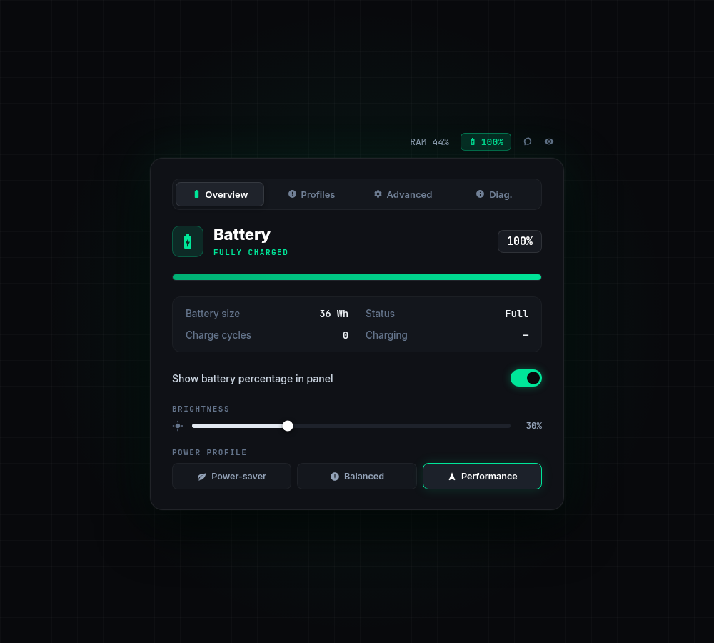
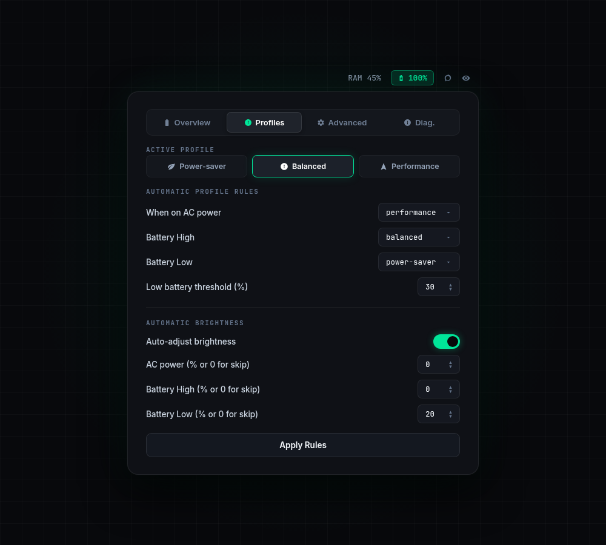
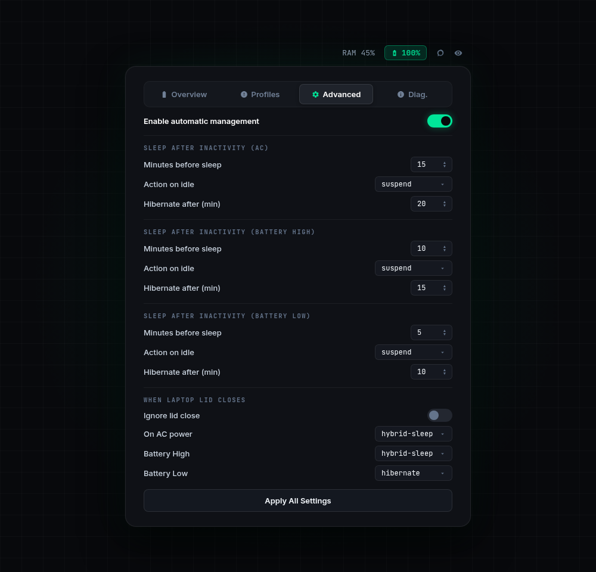

<div align="center">
  <h1>🔋 OMarchy Power Manager</h1>
  <p><b>The ultimate power management and controller plugin for OMarchy Linux.</b></p>
  <p>
    <a href="https://github.com/basecamp/omarchy"></a>
    
    
  </p>
</div>

<p align="center">
  
</p>

Welcome to **OMarchy Power Manager**, an advanced power management and controller plugin that expands OMarchy's default power capabilities with deep systemd integration, smart profiles, and hibernation support.

Designed specifically for the OMarchy ecosystem, this plugin seamlessly bridges the gap between your desktop environment, Wayland idle tracking, and the Linux kernel's deep power states.

---

## 📸 Interface Tour

### 📊 Overview Dashboard
Get real-time visibility into your battery metrics, charging status, power draw, and quickly toggle battery percentage visibility on your OMarchy top bar.

<p align="center">
  
</p>

---

### ⚡ Dynamic Power Profiles
Fine-tune system behavior across **AC Power**, **Battery High**, and **Battery Low** states with custom low-battery thresholds, sleep actions, and idle timeouts.

<p align="center">
  
</p>

---

### 🛠️ Advanced Lid Rules & Diagnostics
Configure hardware-aware lid-close actions with real-time `systemd-logind` syncing, inspect power capabilities, and run built-in diagnostics.

<p align="center">
  
</p>

---

## ✨ Features

Unlike generic power scripts, OMarchy Power Manager features **dynamic hardware awareness**:
- 🧠 **Smart Battery Thresholds:** Automatically shifts your laptop between AC, Battery High, and Battery Low profiles dynamically based on your actual battery percentage.
- ⚡ **Real-Time Logind Rewriting:** Unplugging your laptop physically rewrites your Linux kernel lid-close rules on the fly via a background `udev` worker. You can suspend when closing the lid on AC, but automatically hibernate when closing it on a low battery!
- 🛡️ **Flawless Wayland Integration:** Native hooks into OMarchy's lock screen and idle timers. Intelligently provides a 60-second grace period upon waking up to prevent instant wake-loops.

## 📦 Installation

### Option 1: OMarchy CLI (Recommended)
If this plugin is listed on the OMarchy Plugin Marketplace, you can install it directly via the shell:
```bash
omarchy plugin install onlyvishesh.power-manager
```

### Option 2: Manual Installation
Clone this repository directly into your OMarchy plugins directory:
```bash
git clone https://github.com/onlyvishesh/omarchy-power-manager.git ~/.config/omarchy/plugins/onlyvishesh.power-manager
```
After installing, restart your shell:
```bash
omarchy restart shell
```

### 🗑️ Uninstallation
If installed via the marketplace:
```bash
omarchy plugin remove onlyvishesh.power-manager
```
If installed manually, simply delete the folder:
```bash
rm -rf ~/.config/omarchy/plugins/onlyvishesh.power-manager
```
*Note: Any lid rules generated by this plugin are safely designed as drop-in overrides. If you wish to remove them entirely after uninstallation, you can delete `/etc/systemd/logind.conf.d/90-power-manager.conf`.*

## ⚙️ Configuration & Defaults

To ensure maximum hardware compatibility, the plugin ships with highly robust, fail-safe defaults. 

- **Low Battery Threshold:** `20%`. Below this, the plugin shifts into emergency power-saving mode.
- **Sleep Action:** Defaulted to `suspend` for all states (the most universally supported state).
- **Idle Timers:**
  - **AC Power:** Sleeps after `30` minutes of inactivity.
  - **Battery High:** Sleeps after `15` minutes.
  - **Battery Low:** Sleeps after `5` minutes.
- **Lid Close:** Defaulted to `suspend` across all three states.
- **Top Bar UI:** The battery percentage text can be toggled on/off natively in the "Overview" tab.

## 🔗 Dependencies

This plugin relies on standard, out-of-the-box Linux utilities. It requires:
- `systemd` / `systemd-logind` (For sleep and hibernation state management)
- `upower` (For battery metrics, natively used by OMarchy)
- `pkexec` (Polkit agent, natively used by OMarchy for secure rule writing)

## 💤 Advanced: Enabling Hibernation on Linux

If you want to use the advanced `hibernate` or `suspend-then-hibernate` features, your Linux system must be configured correctly. By default, many Linux distributions do not have hibernation enabled out of the box.

### 1. Ensure Adequate Swap Space
You must have a Swap Partition or Swap File at least as large as your system RAM. (Check using `swapon --show`).

### 2. Add the `resume` Kernel Parameter
You need to tell the Linux kernel where to resume from when booting.
1. Find the UUID of your swap partition/file (`blkid`).
2. Add `resume=UUID=your-uuid-here` to your bootloader (e.g., GRUB config in `/etc/default/grub`).
3. Update your bootloader (`sudo grub-mkconfig -o /boot/grub/grub.cfg`).

### 3. Add the Resume Hook (Arch/OMarchy)
1. Edit `/etc/mkinitcpio.conf`.
2. Add `resume` to your `HOOKS` array (it must be placed *after* `udev`).
3. Regenerate your initramfs: `sudo mkinitcpio -P`.

## 🔧 Troubleshooting

### 1. "Suspend-then-Hibernate" Fails (NVIDIA Issue)
**Symptom:** You set your action to `suspend-then-hibernate`, but the laptop instantly wakes back up, and `journalctl` shows: `Failed to put system to sleep. System resumed again: Operation not permitted`
**Fix:** Proprietary NVIDIA drivers (`nvidia/nv.c`) often veto complex ACPI states like chained hibernation. Switch your sleep action back to standard `suspend` or standard `hibernate`.

### 2. System Sleeps Immediately After Waking Up
**Fix:** This was a known issue in older versions, but is **fixed in the current release**. The plugin now guarantees a 60-second grace period upon waking up. If you experience weird behavior, go to the **Diag.** tab and click **"Reset All Settings to Defaults"**.

### 3. Lid Settings Don't Seem to Apply
**Fix:** Ensure the background `udev` worker has permissions. When you click "Apply Rules", a GUI prompt asks for your password (via `pkexec`) to write the rules. If you cancel this prompt, the dynamic background rewriting will fail.

---
<div align="center">
  <p>Built with ❤️ for the OMarchy Community.</p>
</div>
